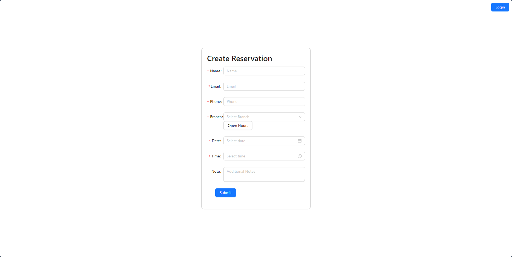
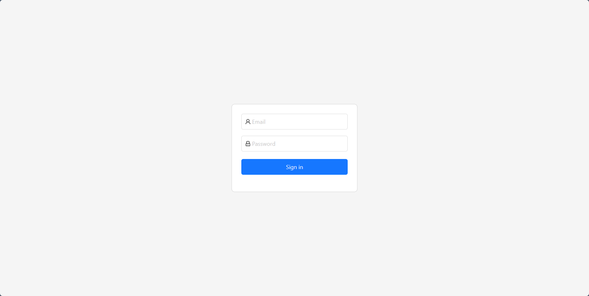
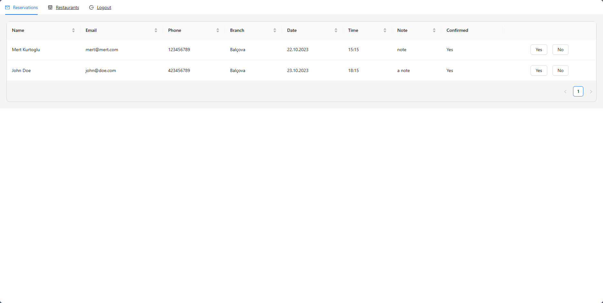
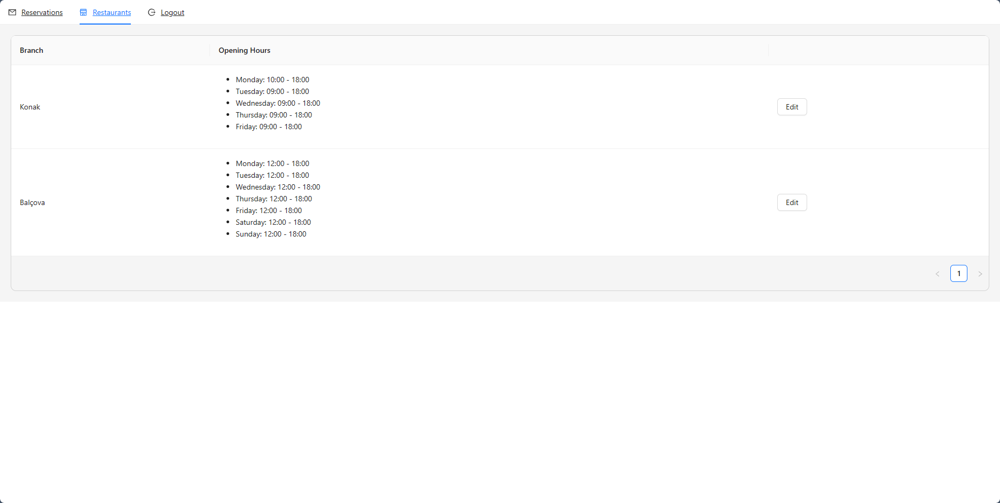

<h3 align="center">Restaurant Reservation</h3>

---

## 📝 Table of Contents

- [About](#about)
- [Getting Started](#getting_started)
- [Usage](#usage)
- [Built Using](#built_using)
- [Acknowledgments](#acknowledgement)
- [Images](#images)

## 🧐 About <a name = "about"></a>

This is a restaurant reservation system. Customer can make reservations and restaurant owner can log in and manage restaurants and reservations.

## 🏁 Getting Started <a name = "getting_started"></a>

These instructions will get you a copy of the project up and running on your local machine for development and testing purposes.

### Prerequisites

```
Node.js
```

### Installing

Clone the repository

```
https://github.com/mertkurtoglu/Restaurant-Reservation.git
```

Open terminal

```
...\GitHub\Restaurant-Reservation> npm install
```

Open another terminal and first reach the client directory

```
...\GitHub\Restaurant-Reservation> cd client
```

Then npm install

```
...\GitHub\Restaurant-Reservation\client> npm install
```

## 🎈 Usage <a name="usage"></a>

- Customer can make reservation.
- Restaurant can edit restaurants hours and reservations.
- Restaurant can confirm or reject reservations.
- When the reservation arrives, an informative e-mail is sent to the restaurant owner.
- When the reservation is confirmed or rejected, an information e-mail will be sent to the customer.

## ⛏️ Built Using <a name="built_using"></a>

- [NodeJs](https://nodejs.org/en/) - Server Environment
- [Express](https://expressjs.com/) - Server Framework
- [Reactjs](https://react.dev/) - Web Framework
- [MongoDB](https://www.mongodb.com/) - Database
- [AntDesign](https://ant.design/) - UI library

## 🎉 Acknowledgements <a name="acknowledgement"></a>

- Use these login informations:
  - Email : test@test.com
  - Password : test123

## 🎉 Images <a name="images"></a>

 
 
 
 

```

```
